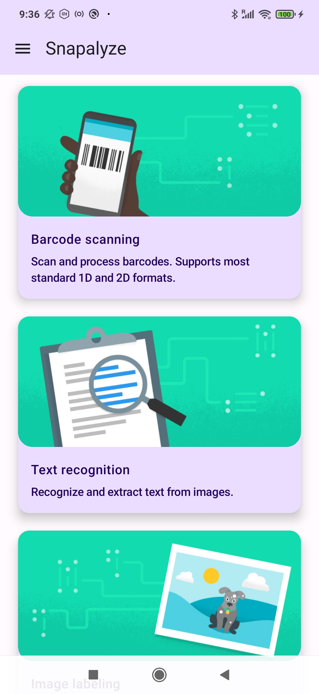
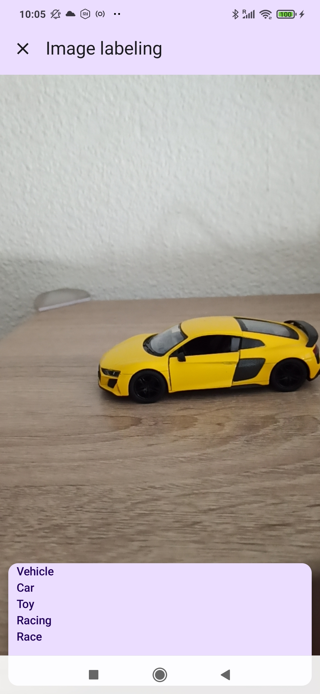
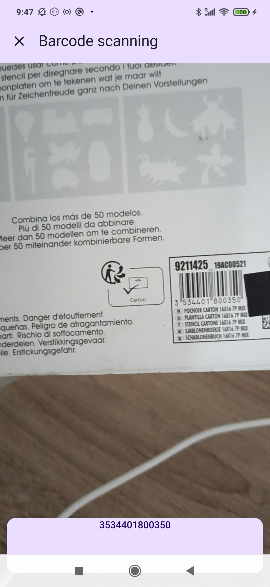
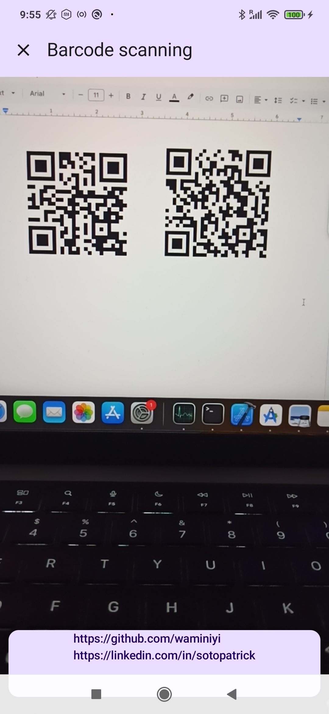
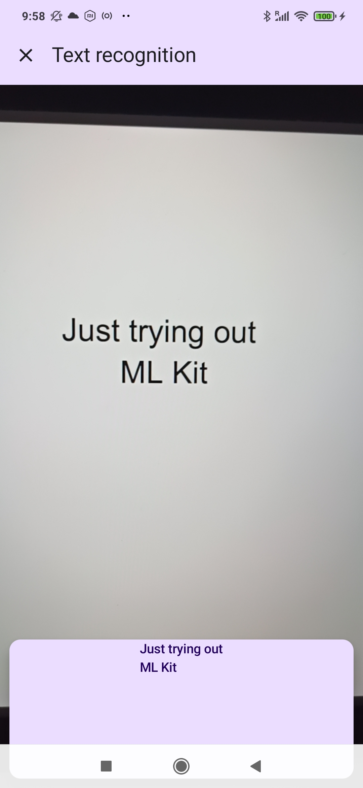

# Snapalyze

Snapalyze is a simple Android app that demonstrates various use cases of **Google's ML Kit**, including image labeling, barcode scanning, and text recognition.

## Features

- **Image Labeling**: Automatically detects and labels objects in images.
- **Barcode Scanning**: Scans and recognizes different barcode formats (QR, UPC, EAN, etc.).
- **Text Recognition**: Extracts text from images like documents or signs.

## Screenshots

 
  
  
  
  
  

## Tech Stack

- **Jetpack Compose**: Used for building the user interface in a declarative way.
- **[Voyager](https://voyager.adriel.cafe/)**: Handles in-app navigation with ease.
- **[Google ML Kit](https://developers.google.com/ml-kit)**: Provides machine learning capabilities.
    - [Image Labeling](https://developers.google.com/ml-kit/vision/image-labeling)
    - [Barcode Scanning](https://developers.google.com/ml-kit/vision/barcode-scanning)
    - [Text Recognition](https://developers.google.com/ml-kit/vision/text-recognition)

